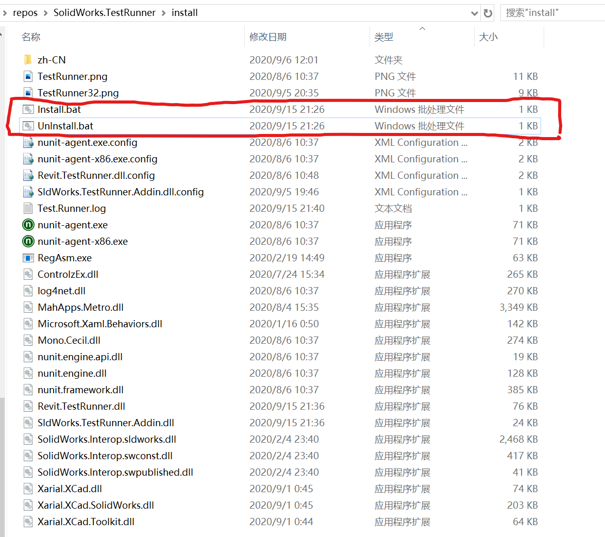
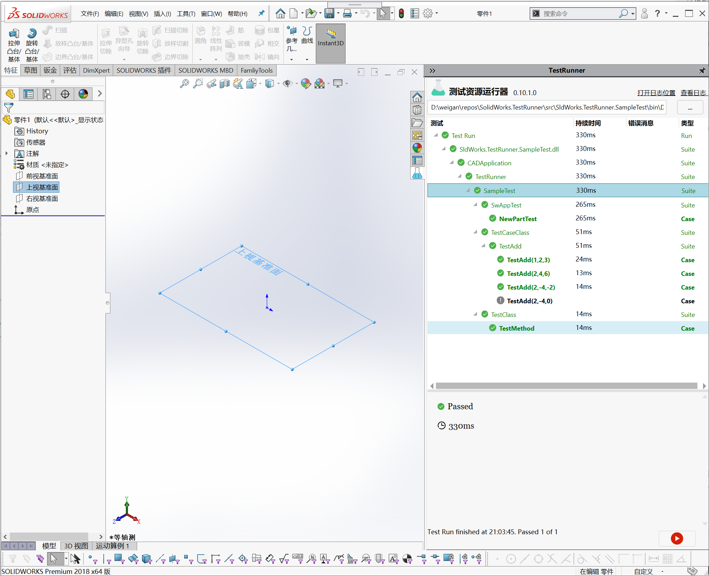
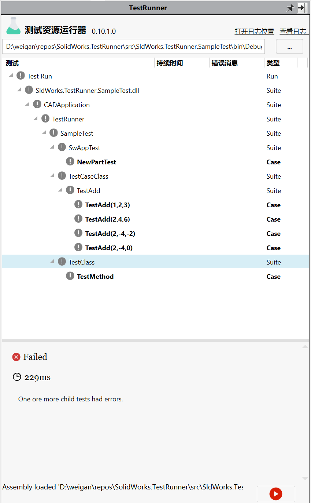
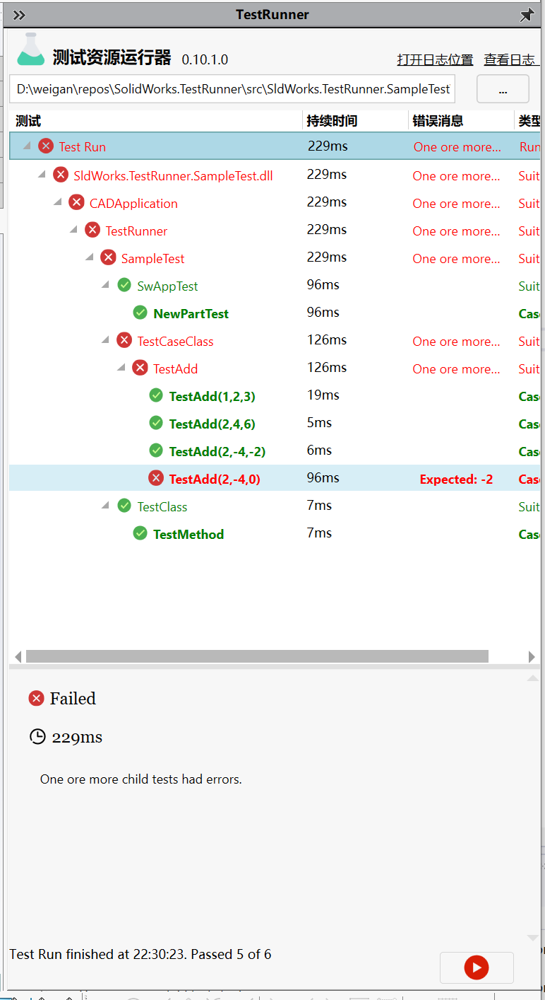

# SolidWorks.TestRunner

SolidWorks.TestRunner is a simple Addin for SolidWorks to run unit tests from a specified test assembly.
 The test framework used is [NUnit v3](https://github.com/nunit).

## Install

**[DownLoad](https://github.com/weianweigan/SldWorks.TestRunner/releases)**

Click *.bat file to Install or UnInstall.

<div>
    
</div>

## Getting started

The Addin hooks in the Taskpane of SolidWorks. 

<div>
    
</div>

By choosing your testing assembly, the view will show all your tests.

<div>
    
</div>

Select the node you want to test and press the ‘Run’. All tests below the selected node will be executed.

<div>
    
</div>


### Write Tests


Create a test project in your solution and get the NUnit nuget package.

Let’s have a look to the SampleTest class. As you see, test are marked by the NUnit Attribute ‘Test’. Also ‘SetUp’ and ‘TearDown’ Attributes are supported.

```c#
public class SampleTest
{
    [SetUp]
    public void RunBeforeTest()
    {
        Console.WriteLine( $"Run 'SetUp' in {GetType().Name}" );
    }
 
    [TearDown]
    public void RunAfterTest()
    {
        Console.WriteLine( $"Run 'TearDown' in {GetType().Name}" );
    }
 
    [Test]
    public void PassTest()
    {
        Assert.True( true );
    }
 
    [Test]
    public void FailTest()
    {
        Assert.True( false, "This Test should fail!" );
    }
}
```

And now we are happy, almost. It would be nice if we can open a file in SolidWorks and make some test with it. This is not easy because we need the `ISldWorks` API Interface of SolidWorks, but we don’t have it available at this point. 
To get the API Interface, change the signature of your Test Method. The SldWorks.TestRunner will inject the desired object in the Test, SetUp or TearDown Method.

```c#
[Test]
public void MultiParameterTest1(ISldWorks swApp)
{
    Assert.IsNotNull(swApp);
    swApp.SendMsgToUser("Hello SolidWorks");
}

```

In your test, you have access to it, and your able to make stuff with it (ex. `swApp.NewDocument(partTemPath, 0, 0, 0) as IPartDoc`)

## License

[MIT](http://opensource.org/licenses/MIT)

## Thanks

1. Base on [Revit.TestRunner](https://github.com/geberit/Revit.TestRunner).

2. [xcad](https://github.com/xarial/xcad) used to implement a SolidWorks addin.

3. [MahApps.Metro](https://github.com/MahApps/MahApps.Metro) -- UI Controls
